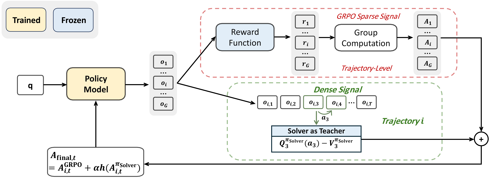
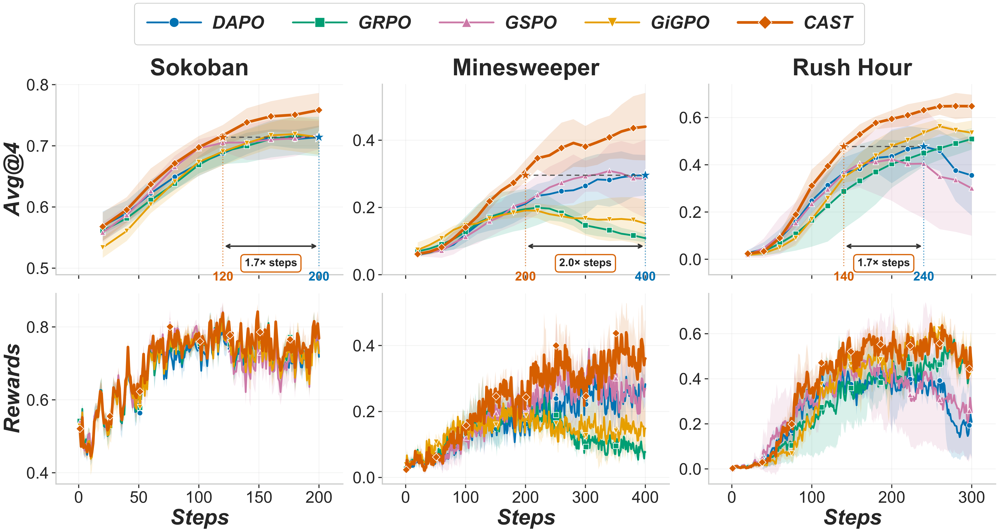

<div align="center">

# 🎮 CAST: Game Solvers as Turn-Level Teachers for LLM Agents

<em>🧭 **C**redit **A**ssignment from **S**olver **T**eachers — turning sparse outcome rewards into dense, turn-level supervision for RL.</em>

<br>

[](https://arxiv.org/abs/2607.25308)
[](https://github.com/rllm-org/rllm)
[](LICENSE)

</div>

---

## 📌 TL;DR

Training LLMs to play long-horizon games with **RLVR** is hard: the reward is a single 0/1 signal at the very end, so the model never learns *which* move actually won or lost the game. This is the classic **credit-assignment** problem.

**CAST** fixes this by recruiting a **game solver as a turn-level teacher** 👨‍🏫. By evaluating the states visited by the agent, the solver estimates how much work remains before a win—or detects that a state is unsolvable. CAST turns the one-step change in this cost-to-go into a per-action **solver advantage** and injects it into RLVR, giving the model dense, turn-level feedback at negligible estimated overhead.

> 💡 **The kicker:** under a soft-optimal solver assumption, the raw solver advantage is proportional to the solver's log-probability for the sampled action. It therefore yields a form of **on-policy, logit-free distillation** that needs only one scalar per action, rather than the teacher's full action distribution. The shaped training objective and its reverse-KL interpretation are derived under the additional assumptions stated in the paper.

---

## 🧠 Method

<div align="center">

</div>

CAST augments **GRPO**'s trajectory-level outcome advantage with a **shifted solver advantage** derived from turn-level cost-to-go changes:

1. **Cost-to-go** $N(s)$ 📏: the number of solver steps needed to win from state $s$: moves in Sokoban and Rush Hour, and reveal actions in Minesweeper (denoted $K(s)$ and computed by a deterministic, peek-free solver). Under an auxiliary shortest-path objective ($-1$ per action, terminal value $0$), $V^{\pi_{\mathrm{Solver}}}(s)=-N(s)$.

2. **Shifted solver advantage** ➕: starting from $A=Q-V$ and shifting by $+1$ so that progress maps to positive credit:

$$
\begin{aligned}
Q^{\pi_{\mathrm{Solver}}}(s_t,a_t)
&=-1+\mathbb{E}_{s_{t+1}}
\left[V^{\pi_{\mathrm{Solver}}}(s_{t+1})\right],\\
\widetilde{A}^{\pi_{\mathrm{Solver}}}(s_t,a_t)
&=Q^{\pi_{\mathrm{Solver}}}(s_t,a_t)
-V^{\pi_{\mathrm{Solver}}}(s_t)+1\\
&=N(s_t)-\mathbb{E}_{s_{t+1}}\left[N(s_{t+1})\right]
\end{aligned}
$$

3. **Signal shaping** 🔧: apply $g(x)=\mathrm{asinh}(x)$ to compress extreme solver-advantage values while preserving their sign. Then batch-level RMS normalization removes cross-game scale differences:

$$
h(x)=\frac{g(x)}{\mathrm{RMS}_{\mathcal{B}}(g)+\epsilon}
$$

4. **Combine with GRPO** 🔗: add the shaped solver signal to GRPO's outcome advantage and broadcast to every token of the turn (paper setting: $\alpha=0.1$):

$$
\hat{A}_{i,t}
=\hat{A}^{\mathrm{outcome}}_{i}
+\alpha\,h\left(\widetilde{A}^{\pi_{\mathrm{Solver}}}_{i,t}\right)
$$

---

## 📊 Results

### 🥇 Main results on the training games

Avg@4 is the mean success rate (%) over four independent rollouts per instance, evaluated on 200 held-out instances per game and split. Values in the Qwen3-4B-Instruct-2507 block are means over three independent runs; closed-source references use a single run. **Bold** = best, <u>underline</u> = second-best within the Qwen3-4B-Instruct-2507 block.

| Type | Approach | Sokoban ID | Sokoban Unseen | Minesweeper ID | Minesweeper Unseen | Rush Hour ID | Rush Hour Unseen | **Avg ID** | **Avg Unseen** |
|---|---|:--:|:--:|:--:|:--:|:--:|:--:|:--:|:--:|
| *Prompting (closed)* | Gemini-2.5-Flash | 64.0 | 33.3 | 38.1 | 23.0 | 73.9 | 63.6 | 58.7 | 40.0 |
| *Prompting (closed)* | Gemini-2.5-Pro | 77.5 | 45.6 | 50.8 | 18.8 | 92.0 | 88.9 | 73.4 | 51.1 |
| *Prompting (closed)* | Claude-Sonnet-4.5 | 60.0 | 29.3 | 34.4 | 22.8 | 56.9 | 42.3 | 50.4 | 31.5 |
| *Prompting (closed)* | Claude-Opus-4.5 | 71.9 | 37.3 | 47.3 | 29.4 | 70.4 | 59.1 | 63.2 | 41.9 |
| *Prompting (closed)* | Claude-Sonnet-4.6 | 79.5 | 47.1 | 57.6 | 42.5 | 88.1 | 81.4 | 75.1 | 57.0 |
| *Prompting (closed)* | Claude-Opus-4.6 | 82.5 | 51.5 | 64.6 | 55.3 | 92.6 | 85.3 | 79.9 | 64.0 |
| Prompting | ReAct (Qwen3-4B) | 44.3 | 16.8 | 4.5 | 0.4 | 1.1 | 0.5 | 16.6 | 5.9 |
| RL | GRPO | 71.3 | 30.5 | 9.7 | 0.5 | <u>53.8</u> | 26.7 | 44.9 | 19.2 |
| RL | GSPO | <u>72.6</u> | 28.3 | 28.2 | 5.0 | 24.8 | 11.5 | 41.9 | 14.9 |
| RL | DAPO | 71.9 | <u>31.3</u> | <u>29.8</u> | <u>7.3</u> | 32.5 | 17.4 | 44.7 | 18.7 |
| RL | GiGPO | 70.6 | 29.6 | 13.7 | 1.4 | 51.9 | <u>31.3</u> | <u>45.4</u> | <u>20.8</u> |
| 🌟 RL | **CAST (Ours)** | **77.0** | **34.8** | **44.7** | **11.0** | **64.7** | **39.5** | **62.1** | **28.4** |

> ✅ Adding the solver signal to the DAPO backbone lifts the ID average **44.7 → 62.1** and Unseen **18.7 → 28.4**. Within the trained Qwen3-4B-Instruct-2507 methods, CAST performs best on **every game under both settings**.

### 📈 Training dynamics

<div align="center">

</div>

> ⏱️ CAST reaches DAPO's peak validation Avg@4 after only **50–60% as many training steps**, corresponding to a **1.7–2.0× speedup in steps-to-target** (Sokoban 120 vs 200, Minesweeper 200 vs 400, Rush Hour 140 vs 240).

### 🌍 Zero-shot OOD transfer

Avg@4 (%) on held-out **ALFWorld** and **WebShop**, with no further fine-tuning. For each trained method, the ALFWorld and WebShop averages aggregate agents transferred from the three source games; **Overall** is the mean of the two domain averages.

| Type | Method | ALFWorld Avg | WebShop Avg | **Overall** |
|---|---|:--:|:--:|:--:|
| Prompting | ReAct | 30.2 | <u>18.8</u> | 24.5 |
| RL | GRPO | 27.2 | 17.5 | 22.4 |
| RL | GSPO | <u>32.1</u> | 17.3 | <u>24.7</u> |
| RL | DAPO | 30.4 | 16.6 | 23.5 |
| RL | GiGPO | 30.9 | 17.9 | 24.4 |
| 🌟 RL | **CAST (Ours)** | **37.9** | **22.7** | **30.3** |

---

## 🚀 Getting Started

```bash
git clone https://github.com/Wloner0809/CAST.git
cd CAST

# Recommended: reproduce the locked environment with uv
uv sync --python 3.10 \
  --extra verl --extra sglang --extra sokoban --extra alfworld --extra webshop
source .venv/bin/activate
```

Alternatively, install the same dependencies with pip:

```bash
python3.10 -m venv .venv
source .venv/bin/activate
python -m pip install torch==2.8.0 torchvision==0.23.0 torchaudio==2.8.0 \
  --index-url https://download.pytorch.org/whl/cu126
python -m pip install \
  https://github.com/Dao-AILab/flash-attention/releases/download/v2.8.3/flash_attn-2.8.3%2Bcu12torch2.8cxx11abiTRUE-cp310-cp310-linux_x86_64.whl
python -m pip install -r requirements.txt
```

For a smaller installation or an alternative rollout backend, first install the matching PyTorch and FlashAttention wheels as above, then choose the required backend/game extras. The commands below are alternatives, not a sequence to run in full:

```bash
# Examples: choose one combination.
python -m pip install -e '.[verl,sglang,sokoban]'
python -m pip install -e '.[verl,sglang,alfworld]'
python -m pip install -e '.[verl,sglang,webshop]'
python -m pip install -e '.[verl,vllm,sokoban]'
```

WebShop additionally requires Java 11 and the spaCy language models:

```bash
python -m spacy download en_core_web_sm
python -m spacy download en_core_web_lg
```

Dependency versions and compatibility constraints are defined in `pyproject.toml` and locked in `uv.lock`.

<details>
<summary>🏠 <b>ALFWorld data</b> (needed for the OOD transfer eval)</summary>

`data/datasets/alfworld/json_2.1.1/valid_seen` holds the 140 TextWorld games referenced by `eval_id.parquet`, taken from the [ALFWorld](https://github.com/alfworld/alfworld) release of the [ALFRED](https://github.com/askforalfred/alfred) dataset (MIT).
</details>

<details>
<summary>🛒 <b>WebShop setup</b> (needed for the OOD transfer eval)</summary>

The product corpus ships with the repo, but the BM25 index is a build artifact and must be generated once:

```bash
export WEBSHOP_DATA_DIR="$PWD/data/datasets/webshop/webshop_data"   # must be absolute
export JAVA_HOME=/usr/lib/jvm/java-11-openjdk                       # any Java 11
export PATH="$JAVA_HOME/bin:$PATH"

cd rllm/environments/webshop/webshop_pkg/search_engine
mkdir -p resources resources_1k
python convert_product_file_format.py    # corpus -> resources*/documents.jsonl

for name in resources resources_1k; do
  python -m pyserini.index.lucene --collection JsonCollection \
    --input "$name" --index "indexes${name#resources}" \
    --generator DefaultLuceneDocumentGenerator --threads 1 \
    --storePositions --storeDocvectors --storeRaw
done
```

`WEBSHOP_DATA_DIR` must be absolute because the scripts run from `search_engine/`. Index into both `indexes/` and `indexes_1k/`: the env picks between them by `num_products`. Use `run_indexing.sh` only if you also populate `resources_100/` and `resources_100k/`, which the 1000-product corpus does not cover.
</details>

<details>
<summary>🐳 <b>Docker setup</b></summary>

```bash
docker build -t cast .
docker create --runtime=nvidia --gpus all --net=host --shm-size="10g" \
  --cap-add=SYS_ADMIN -v "${PWD}:/workspace/cast" -v /tmp:/tmp \
  --name cast-container cast sleep infinity
docker start cast-container
docker exec -it cast-container bash
```
</details>

### 🎯 Train a CAST agent

```bash
export MODEL_PATH=Qwen/Qwen3-4B-Instruct-2507

# Sokoban 📦
DATASET=id ALGO_MODE=default \
  CAST_ALPHA=0.1 GAME_OVER_ON_DEADLOCK=1 \
  bash scripts/train_scripts/train_sokoban_agent_cast.sh

# Minesweeper 💣
DATASET=id ALGO_MODE=default \
  CAST_ALPHA=0.1 \
  bash scripts/train_scripts/train_minesweeper_agent_cast.sh

# Rush Hour 🚗
DATASET=id ALGO_MODE=default \
  CAST_ALPHA=0.1 \
  bash scripts/train_scripts/train_rush_hour_agent_cast.sh
```

The paper trains for 200, 400, and 300 optimizer steps on Sokoban, Minesweeper, and Rush Hour respectively; each launch script already defaults to its game's step count, and checkpoints and validation are written every 20 steps. Baseline runners (GRPO / GSPO / DAPO / GiGPO) are provided alongside the CAST scripts, and [`scripts/train_scripts/EXPERIMENTS.md`](scripts/train_scripts/EXPERIMENTS.md) records the exact settings for every run and ablation reported in the paper.

---

## 📂 Repository Layout

```
CAST/
├── assets/                  🖼️ README figures (PNG)
├── examples/                🎲 per-game data prep + training entry points
│   ├── sokoban/  minesweeper/  rush_hour/  alfworld/  webshop/
├── scripts/train_scripts/   🚀 launch scripts (CAST + baselines)
├── launch_scripts/          ⚙️ single/multi-node launch helpers
└── rllm/                    🧩 rLLM framework (agents, envs, trainer)
```

---

## 📝 Citation

```bibtex
@article{cast2026,
  title={CAST: Game Solvers as Turn-Level Teachers for LLM Agents},
  author={Wang, Yu and Zhang, Yi-Kai and Shi, Wentao and Ye, Ziang and Miao, Yuchun and Sun, Yueqing and Gu, Qi and Cai, Xunliang and Guo, Lan-Zhe and Ye, Han-Jia and Feng, Fuli},
  journal={arXiv preprint arXiv:2607.25308},
  year={2026}
}
```

## 🙏 Acknowledgements

CAST is implemented on top of the open-source [**rLLM**](https://github.com/rllm-org/rllm) framework and its `verl` training backend. We thank the rLLM team and the broader RL community. 💙
